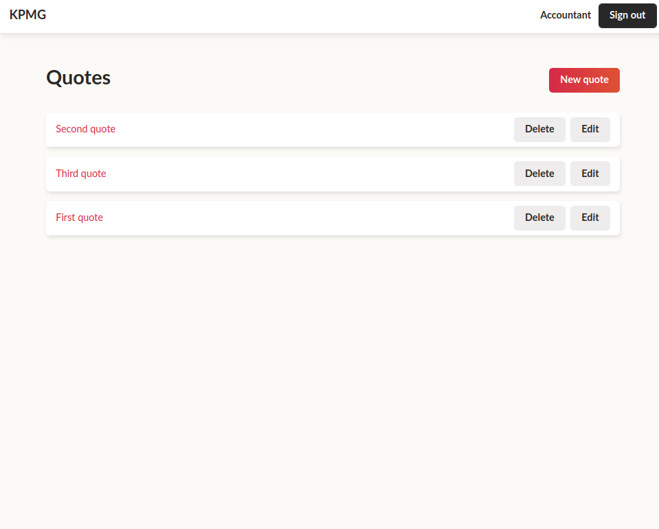
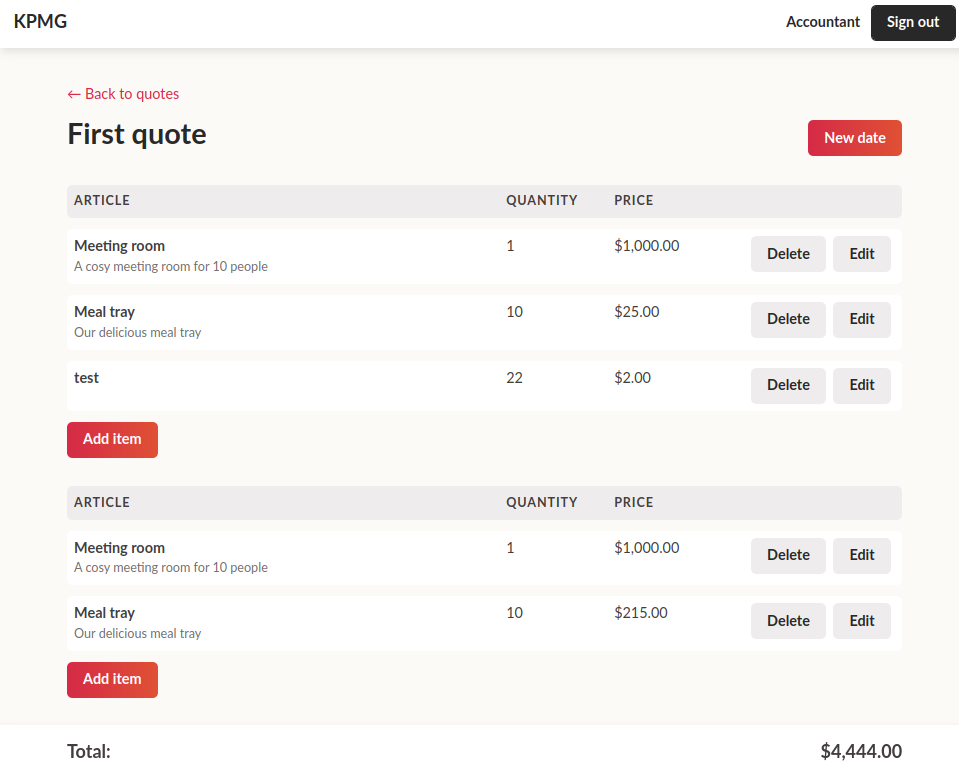

# README

Basic demo application built to learn turbo feature in Rails 7.0 

Basic domain 
* Quote's are limited to Company
* A Company has a list of user's to can login
* A Quote has many line items
* line items are grouped by Date made

Models
* User (devise based)
* Company (owner of all data for access control scope)
* Quote (main item)
* LineItemDate (level 1)
* LineItem ( level 2)

Controllers
* Page -> home
* Quotes -> crud
* LineItemDate -> crud nested under quote
* LineItem -> crud nested under line item date

Stategy
* Ruby 3.1 / Rails 7.0.3 base stack 
* Simple forms for adding html to forms
* Mainly full stack ActionDispatch::SystemTestCase tests due to heavy js features
* Devise for user authentication
* 
* Minimal CSS no framework naming https://en.bem.info/methodology/css/

All Based on Great tutorial https://www.hotrails.dev/turbo-rails
to get up to speed on Rails 7

== Screen shots
=== Index Page

==== Show Page
